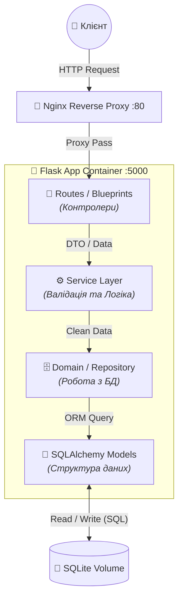

<div align="center">

  

  # 🎲 Гральна Комора (Ne_Programisty)

  **Сучасний E-commerce вебзастосунок для продажу настільних ігор.**
  
  [](https://www.python.org/)
  [](https://flask.palletsprojects.com/)
  [](https://www.docker.com/)
  [](https://nginx.org/)
  [](/apidocs)
  [](LICENSE)
  [](https://docs.pytest.org/en/stable/)

  [🌐 Демо (render.com)](https://ne-programisty.onrender.com/) • [📚 Документація API](https://ne-programisty.onrender.com/apidocs) • [🐛 Повідомити про баг](https://ne-programisty.onrender.com/feedback)

</div>

## 📝 Про проєкт

**"Гральна Комора"** — це більше, ніж просто інтернет-магазин. Це повнофункціональна платформа, яка поєднує в собі каталог товарів, систему управління контентом (CMS), RESTful API та клієнтський інтерфейс.

Ми пройшли шлях від статичних HTML-сторінок до складної мікросервісної архітектури, загорнутої в Docker-контейнери. Проєкт демонструє використання сучасних підходів у веб-розробці: **MVC**, **Service Layer Pattern**, **JWT Auth**, **Containerization**.

### 🚀 Ключові можливості
* 🛍️ **Повний цикл E-commerce:** Перегляд каталогу, кошик, оформлення замовлення, історія покупок.
* 🔐 **Безпека:** JWT-авторизація (Access/Refresh токени), хешування паролів, захист від XSS/CSRF.
* 👥 **Рольова модель (RBAC):** Розмежування прав доступу (User / Moderator / Admin).
* ⚙️ **Адмін-панель:** Керування товарами, новинами, замовленнями та користувачами через UI.
* 💬 **Соціальна складова:** Система відгуків та новинна стрічка.
* 🐳 **Cloud-Ready:** Повна контейнеризація через Docker + Nginx.

## 🛠 Технічний стек

Ми обрали цей стек для забезпечення балансу між швидкістю розробки (Python/Flask) та продуктивністю (Nginx/Docker).

| Категорія | Технології | Обґрунтування |
| :--- | :--- | :--- |
| **Backend** | `Python 3.13`, `Flask 3.0` | Гнучкість, швидкість розробки, потужна екосистема розширень. |
| **Database** | `SQLite`, `SQLAlchemy`, `Alembic` | Надійність, простота міграцій, підтримка ORM. |
| **API** | `Flask-RESTful`, `Flasgger`, `JWT` | Стандартизація API, автодокументація Swagger UI. |
| **DevOps** | `Docker`, `Docker Compose`, `Nginx` | Ізоляція середовища, Reverse Proxy для статики та безпеки. |
| **Frontend** | `HTML5`, `CSS3`, `Bootstrap 5`, `JS` | Адаптивний дизайн (Mobile-First), динамічні інтерфейси. |
| **Testing** | `Pytest`, `Postman` | Автоматизоване тестування API та інтеграційні сценарії. |

## 📂 Структура проєкту

Ми дотримуємося чистої архітектури, розділяючи бізнес-логіку, моделі та представлення.

```text
Ne_Programisty/
├── app/
│   ├── domain/          # 🧠 Data Access Layer(Спілкування з БД)
│   ├── models/          # 🗄️ ORM моделі бази даних
│   ├── service/         # ⚙️ Шар сервісів (Service Layer(бізнес-логіка))
│   ├── routes.py        # 📍 Маршрути (Контролери)
│   ├── routes_api.py    # 🔌 API endpoints
│   ├── static/          # 🎨 CSS, JS, Images (Assets)
│   └── templates/       # 📄 HTML шаблони (Jinja2)
├── migrations/          # 🔄 Міграції бази даних (Alembic)
├── tests/               # 🧪 Unit та Integration тести
├── instance/
│   └── database.db      # 💾 SQLite база даних (зберігається локально)
├── docker-compose.yml   # 🐳 Оркестрація контейнерів
├── Dockerfile           # 🏗️ Інструкція збірки образу Flask
├── nginx.conf           # 🦁 Конфігурація веб-сервера
├── requirements.txt     # 📦 Залежності Python
├── app.py               # 🚀 Точка входу в застосунок
└── README.md            # 📖 Цей файл
```

## 🏗 Архітектура системи

Проєкт побудовано за **Багатошаровою архітектурою (Layered Architecture)**, що дозволило відокремити бізнес-логіку від маршрутизації.



## 🧱 Опис шарів (Project Structure)

Ми організували код так, щоб кожен шар виконував свою унікальну функцію:

1. ### 📍 Routes (app/routes_api.py):

    - Приймає HTTP-запити від клієнта.

    - Викликає відповідні методи з Service.

    - Повертає відповідь (HTML сторінку або JSON).

    - Тут немає жодної бізнес-логіки.

2. ### ⚙️ Service (app/service/):

    - Головний мозок застосунку.

    - Валідує вхідні дані (наприклад, перевіряє, чи ціна > 0, чи існує картинка).

    - Приймає рішення: можна виконувати операцію чи ні.

    - Передає очищені дані в шар Domain.

3. ### 🗄️ Domain / Repository (app/domain/):

    - Шар доступу до даних (DAL).

    - Відповідає за безпосередню комунікацію з базою даних.

    - Виконує db.session.add, commit, query.

    - Інкапсулює (ховає) складні SQL/ORM запити від сервісів.

4. ### 📄 Models (app/models/):

    - Містить Python-класи, які описують таблиці БД (SQLAlchemy Models).

## 🧪 Тестування та Якість

Ми приділили велику увагу стабільності роботи API.

### 1\. Postman Collections

Розроблено повний набір тестів для перевірки всіх ендпоінтів.

  * **Сценарій 1:** Повний цикл реєстрації та авторизації.
  * **Сценарій 2 (E-commerce):** Додавання товарів у кошик -\> Оформлення замовлення.
  * **Сценарій 3 (Admin):** CRUD операції з новинами та товарами.

### 2\. Unit & Integration Tests

Написано тести на `pytest` для перевірки критично важливих функцій (розрахунок ціни, валідація токенів).


## 🔥 Технічні виклики та рішення

Під час розробки ми зіткнулися з низкою проблем, які успішно вирішили:

### 🔴 Проблема: Нескінченний цикл перезавантаження (Infinite Reload Loop)

  * **Опис:** Фронтенд скрипт намагався оновити токен, отримував 404, і знову перезавантажував сторінку.
  * **Причина:** Запит йшов на `/api/v1/cart` (однина) замість `/api/v1/carts` (множина).
  * **Рішення:** Виправлено URL та додано механізм `Circuit Breaker` (запобіжник) з використанням `sessionStorage`, щоб зупинити цикл після однієї невдалої спроби.

### 🔴 Проблема: Доступ до бази даних (Permission Denied)

  * **Опис:** При локальному запуску `python app.py` виникала помилка запису в `/app/data` (шлях для Docker).
  * **Рішення:** Реалізовано "розумний" конфіг в `config.py` та `.env`, який автоматично визначає середовище (Docker чи Localhost) і підставляє правильний шлях до БД (абсолютний шлях через `os.path.abspath`).

### 🔴 Проблема: Nginx не бачив картинки

  * **Опис:** Статичні файли не завантажувалися через Nginx (404).
  * **Рішення:** Налаштовано коректні `Volumes` в `docker-compose.yml` та оптимізовано конфіг `nginx.conf` для проксіювання статики.

## 🚀 Інструкція з розгортання 

Ми підготували два сценарії запуску. Виберіть той, що вам підходить.

### 🔵 Варіант А: Docker (Рекомендовано) 🐳

Це найкращий варіант, бо він гарантує, що все запрацює так само, як у нас. Вам не треба встановлювати Python чи налаштовувати змінні середовища вручну.

**Крок 1. Клонування репозиторію**
Відкрийте термінал і виконайте:

```bash
git clone https://github.com/DanyloLyk/Ne_Programisty.git
cd Ne_Programisty
```

**Крок 2. Запуск контейнерів**
Ця команда збере образи і запустить їх у фоновому режимі:

```bash
docker-compose up -d --build
```

**Крок 3. Перевірка статусу**
Переконайтеся, що обидва контейнери (`shop_container` та `shop_nginx`) мають статус `Up`:

```bash
docker-compose ps
```

**Крок 5. Вхід на сайт**
🎉 Відкрийте браузер: **http://127.0.0.1** (Порт 80)

-----

### 🟢 Варіант Б: Локальний запуск (Dev Mode) 🐍

Використовуйте цей варіант, якщо хочете розробляти код і бачити зміни без перезапуску Docker.

**Крок 1. Підготовка оточення**

```bash
# Windows
python -m venv venv
venv\Scripts\activate

# macOS / Linux
python3 -m venv venv
source venv/bin/activate
```

**Крок 2. Клонування репозиторію**

```bash
git clone https://github.com/DanyloLyk/Ne_Programisty.git
```

**Крок 3. Встановлення залежностей**

```bash
cd Ne_Programisty
pip install -r requirements.txt
```

**Крок 4. Запуск сервера**

```bash
python app.py
```

**Крок 5. Вхід на сайт**
👨‍💻 Відкрийте браузер: **http://127.0.0.1:5000** (Порт 5000)

> **Примітка:** У цьому режимі Nginx не використовується, тому ви звертаєтесь напряму до Flask.


## 👨‍💻 Команда (Dream Team)

Цей проєкт став можливим завдяки злагодженій роботі команди **Ne\_Programisty**:

| Учасник | Роль | Внесок |
| :--- | :--- | :--- |
| **Лукащук Данило** | 🦁 Team Lead / Fullstack | Архітектура, Docker, Nginx, Адмінка, координація. |
| **Базюк Максим** | 🐻 Backend | Логіка Feedback, міграції, новини, 3D-лоадер. |
| **Чорноус Сергій** | 🦊 Frontend / Security | Auth System, JWT, логіка Кошика та Замовлень. |
| **Кондратюк Дмитро**| 🐼 QA / Frontend Dev | UI/UX, анімації, тестування, сторінка профілю. |


## 🏁 Висновки та Рефлексія

Робота над проєктом "Гральна Комора" дозволила нам на практиці закріпити знання повного циклу розробки ПЗ (SDLC).

**Що ми вивчили:**

1.  **Git Flow:** Як ефективно працювати в команді без конфліктів.
2.  **Docker:** Чому "працює на моєму комп'ютері" — це не аргумент, і як контейнери вирішують це.
3.  **API Design:** Важливість правильного неймінгу (`/carts` vs `/cart`) та документації (Swagger).
4.  **Security:** Чому не можна зберігати паролі відкритим текстом і навіщо потрібен JWT.

Проєкт готовий до подальшого масштабування (наприклад, підключення PostgreSQL та Redis) і може служити портфоліо для кожного учасника команди.

-----

<div align="center">
  <sub>Розроблено з ❤️ командою Ne_Programisty, 2025</sub>
</div>
