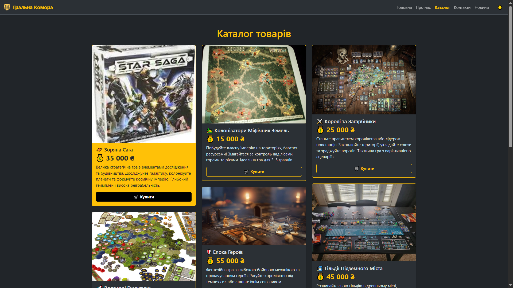

# Звіт з лабораторної роботи 3

## Розробка базового вебпроєкту

### Інформація про команду
- Назва команди: Ne_Programisty

- Учасники:
  - Лкащук Данило Миколайович - Team Lead / Fullstack Developer 

    (відповідальний за організацію роботи в Trello, GitHub, Discord та Telegram; створення репозиторію, requirements.txt, злиття гілок, перевірка PR; бекенд Flask, frontend, анімації, стилі, верстка, сторінки about, contacts, index, виправлення багів, документація, .gitignore, CHANGELOG.md)

  - Чорноус Сергій Павлович - Frontend Developer
    
    (відповідальний за інтерфейс проєкту, розробка інтерфейсу сайту, створення шаблонів HTML/CSS, структура base.html, catalog, footer, navbar, frontend-layout, верстка, логіка адаптивності, створення темного/світлого режимів)

  - Базюк Максим Володимирович - Backend Developer 
    
    (відповідальний за логіку проєкту, розробка логіки сайту на Flask, підключення бази даних, створення API для каталогу, з’єднання бекенду з фронтендом, створення маршрутів)

  - Кондратюк Дмитро Анатолійович - QA / Fullstack-Developer 
    
    (відповідальний за правильну роботу сайту, тестування, перевірення функціональності сайту на різних пристроях,  створення сторінок news, contacts, заповнення контенту, допомога з анімаціями, стилями та фронтендом)

## Завдання

### Обрана предметна область

Онлайн-магазин настільних ігор “Гральна Комора” — вебзастосунок-візитка магазину, який презентує асортимент настільних ігор, інформацію про компанію, контакти та новини.
Сайт створено з використанням Flask (Python) та системи шаблонів Bootstrap 5.

Основна мета — розробити адаптивний вебсайт із швидким рендерингом сторінок, чистою архітектурою, сучасним дизайном та красивими анімаціями.

### Реалізовані вимоги

Вкажіть, які рівні завдань було виконано:

- [+] Рівень 1: Створено сторінки “Головна” та “Про нас” з контентом, який відповідає тематиці магазину.
- [+] Рівень 2: Додано додаткові сторінки — “Каталог”, “Контакти” та “Новини”. Всі сторінки відображаються в меню та мають адаптивну верстку під ПК та мобільні пристрої.

## Хід виконання роботи

### Підготовка середовища розробки

Опишіть процес встановлення та налаштування:

- Версія Python: 3.12.3
- Встановлення Flask
```
pip install flask
```
- Інші використані інструменти:
    - VS Code — основне середовище розробки
    - Git + GitHub — для контролю версій та командної роботи
    - CSS — написані персональні анімації
    - Bootstrap 5 — для базової адаптивної верстки
    - SQLite — для локального збереження даних (каталог, новини)

### Структура проєкту

Наведіть структуру файлів та директорій вашого проєкту:

```
Ne_Programisty/
│   .gitignore
│   app.py
│   CHANGELOG.md
│   lab02-report.md
│   README.md
│   requirements.txt
│
├───.idea
│   │   .gitignore
│   │   copilot.data.migration.agent.xml
│   │   copilot.data.migration.ask.xml
│   │   copilot.data.migration.ask2agent.xml
│   │   copilot.data.migration.edit.xml
│   │   misc.xml
│   │   modules.xml
│   │   Ne_Programisty.iml
│   │   PylintPlugin.xml
│   │   vcs.xml
│   │
│   └───inspectionProfiles
│           profiles_settings.xml
│
├───app
│   │   routes.py
│   │   utils.py
│   │   __init__.py
│   │
│   ├───models
│   │   │   desktop.py
│   │   │   news.py
│   │   │
│   │   └───__pycache__
│   │           desktop.cpython-313.pyc
│   │
│   ├───static
│   │   ├───css
│   │   │       news.css
│   │   │       style.css
│   │   │
│   │   └───images
│   │           about1.jpg
│   │           about2.jpg
│   │           catalog2.jpg
│   │           catalog3.jpg
│   │           catalog4.jpg
│   │           catalog5.jpg
│   │           catalog9.jpg
│   │           logo.png
│   │           nastolnye-strategii.jpg
│   │           news1-2.jpg
│   │           news1-3.jpg
│   │           news1.jpg
│   │           news2-2.jpg
│   │           news2-3.jpg
│   │           news2.jpg
│   │           news3-2.jpg
│   │           news3.jpg
│   │           news4-2.jpg
│   │           news4.jpg
│   │           news5-2.jpg
│   │           news5.jpg
│   │           news6-2.jpg
│   │           news6-3.jpg
│   │           news6.jpg
│   │           star_saga.jpg
│   │
│   ├───templates
│   │   │   about.html
│   │   │   base.html
│   │   │   catalog.html
│   │   │   contacts.html
│   │   │   index.html
│   │   │   news.html
│   │   │
│   │   └───components
│   │           catalog-card-mb.html
│   │           catalog-card-pc.html
│   │           footer.html
│   │           header.html
│   │
│   └───__pycache__
│           routes.cpython-313.pyc
│           utils.cpython-313.pyc
│           __init__.cpython-313.pyc
│
├───instance
│       mydatabase.db
│
└───lab-reports
    └───lab3
        │   lab03-report-Danylo.md
        │
        └───screenshots
                about.png
                catalog.png
                contacts.png
                index.png
                news1.png
                news2.png
```

### Опис реалізованих сторінок

#### Головна сторінка (index.html)

Містить коротку суть магазину, заголовок та кнопки з посиланням на інші сторінки.
Використано базовий шаблон base.html, у який підключаються інші сторінки через Jinja2 наслідування.
Також реалізовано адаптивні елементи (зображення, кнопки, анімації при наведенні).

#### Сторінка "Про нас" (about.html)

Розповідає історію компанії, цінності, напрямки діяльності.
Оформлена з використанням CSS-ефектів, шарним дизайном та карточками Bootstrap.

#### Сторінка “Каталог” (catalog.html)

Відображає каталог настільних ігор із бази даних.
Реалізовано шаблони карток товарів (catalog-card-pc.html, catalog-card-mb.html) — окремо для комп’ютерів і мобільних пристроїв.
Використано Jinja2 цикл for для виведення товарів з БД.

####  Сторінка “Контакти” (contacts.html)

Містить контактну інформацію, адресу, карту (посилання на Google Maps) та форму зворотного зв’язку.

#### Сторінка “Новини” (news.html)

Показує актуальні новини з життя магазину, оновлення асортименту тощо.
Створено дизайн карточок для них з анімаціями CSS, а також з можливістю переглянутти детальніше(додаткові фото та конкретнішу інформацію про ту, чи іншу подію в житті магазину) про конкретну новину(використано модалки).

## Ключові фрагменти коду

### Маршрутизація в Flask

Наведіть приклад налаштування маршрутів у файлі `app.py`:

```python
from flask import Blueprint, render_template
from .models.desktop import Desktop
from . import db
from .utils import download_image

main = Blueprint('main', __name__)

@main.route('/')
def index():
    return render_template('index.html')

@main.route('/about')
def about():
    return render_template('about.html')

@main.route('/news')
def news():
    return render_template('news.html')

@main.route('/contacts')
def contacts():
    return render_template('contacts.html')

@main.route('/catalog')
def catalog():


    db.session.commit()
    desktops = Desktop.query.all()
    return render_template("catalog.html", desktops=desktops)

```

### Базовий шаблон

Наведіть фрагмент базового шаблону `base.html`:

```html
<!DOCTYPE html>
<html lang="uk" data-bs-theme="auto">

<head>
    <meta charset="UTF-8">
    <meta name="viewport" content="width=device-width, initial-scale=1.0">
    <title>Document</title>
    <link rel="stylesheet" href="{{ url_for('static', filename='css/style.css') }}">
    <link href="https://cdn.jsdelivr.net/npm/bootstrap@5.3.8/dist/css/bootstrap.min.css" rel="stylesheet" integrity="sha384-sRIl4kxILFvY47J16cr9ZwB07vP4J8+LH7qKQnuqkuIAvNWLzeN8tE5YBujZqJLB" crossorigin="anonymous">
    <link rel="stylesheet" href="https://cdnjs.cloudflare.com/ajax/libs/font-awesome/6.4.0/css/all.min.css" />
</head>

<body>
    
    <main>
    
    
    </main>
    
    <script src="https://cdn.jsdelivr.net/npm/bootstrap@5.3.3/dist/js/bootstrap.bundle.min.js"></script>
    <link rel="stylesheet" href="https://cdnjs.cloudflare.com/ajax/libs/animate.css/4.1.1/animate.min.css"/> 
    <script src="https://cdn.jsdelivr.net/npm/masonry-layout@4.2.2/dist/masonry.pkgd.min.js" async></script>
</body>

```

## Розподіл обов'язків у команді

Опишіть внесок кожного учасника команди:

- Лкащук Данило Миколайович: 
    - Відповідальний за організацію роботи (Trello, GitHub, Discord та Telegram);
    - Реалізація сторінок index.html, contacts.html, about.html;
    - Створення маршрутів (в routes.py) репозиторію, requirements.txt, .gitignore, злиття гілок, перевірка PR; 
    - бекенд Flask, frontend, анімації, стилі, документація; 
    - Створення та налаштування анімацій (CSS);
    - Вирішення технічних помилок, злиття гілок;

- Чорноус Сергій Павлович:
    - Відповідальний за інтерфейс проєкту;
    - Створення базової структури фронтенду;
    - Створення шаблонів HTML/CSS;
    - Реалізація base.html, catalog.html, footer.html, navbar.html, створення темного/світлого режимів
    - Адаптація під мобільні пристрої;
    - Налагодження функцій завантаження каталогу

- Базюк Максим Володимирович: 
    - Відповідальний за логіку проєкту;
    - Організація структури Flask-додатку, налаштування routes.py; 
    - Підключення даних до шаблонів через Flask
    - Реалізація логіки роботи з базою даних (desktop.py, news.py);
    - З’єднання бекенду з фронтендом;

- Кондратюк Дмитро Анатолійович: 
    - Відповідальний за правильну роботу сайту;
    - Тестування, перевірка функціональності сайту на різних пристроях;
    - Додавання контенту до сторінок news та about;
    - Допомога з оформленням стилів та анімацій;
    - Створення сторінок news, contacts;
    - Допомога зі створенням about.html, catalog.html;

## Скріншоти

Додайте скріншоти основних сторінок вашого вебзастосунку:

### Головна сторінка


### Сторінка "Про нас"


### Сторінка "Каталог"



### Сторінка "Контакти"


### Сторінка "Новини"

<p center>
  
  
</p>

_Ліворуч — загальний вигляд сторінки новин, праворуч — приклад відкритої новини (модалка)_


### Висновки

_У ході виконання лабораторної роботи №3 команда “Ne_Programisty” успішно реалізувала адаптивний вебсайт-візитку онлайн-магазину настільних ігор “Гральна Комора”, використовуючи стек технологій Flask (Python), HTML, CSS (власноручні анімації), Bootstrap 5, SQLite та Git/GitHub для командної взаємодії._

_Кожен учасник команди вніс значний внесок у спільний результат._

#### Команда успішно виконала всі завдання рівня 1 та 2:

- Створила основні сторінки сайту("Головна" та "Про нас");
- Створили контент для всіх сторінок відповідно де нашої предметної області
- Створили додатково ще три статичні сторінки("Контакти", "Новини", "Каталог")
- Забезпечили відображення в меню та коректну верстку
- Реалізувала адаптивність під мобільні пристрої
- Налагодила маршрутизацію між сторінками
- Виконала ручну реалізацію CSS-анімацій 
- Повністю інтегрувала фронтенд з бекендом через Flask.
- Створила унікальну ідею для сайту
- Добавили зміну теми біла/чорна;

#### Наша команда зіткнулась з наступними труднощами:
- Освоєння GitHub та Git;
- Злиття гілок;
- З некоректним підключенням стилів та анімацій CSS до класів HTML;
- Вивчення можливостей Flask та Bootstrap;
- Організація файлової структури проєкту;
- Створення анімацій CSS;

#### Під час роботи було вдосконалено навички та отримані нові знання:
- Командної взаємодіЇ;
- Роботи з Git та GitHub;
- Навчились роботи з репозиторіями(клонування, коміти, пуш, пул)
- Організація структури об'єкту;
- Використання VS Code і Git інтеграції;
- Створення гілок і Pull Request;
- Реалізація анімацій;
- Інтеграція фронтенду з бекендом за допомогою Flask, створення маршрутів; 
- Вирішення конфліктів злиття гілок та в PR;
- Підвищено рівень володіння HTML, Bootstrap, Python, Flask та CSS;

*Тобто ми не тільки покращили hard скіли, а й soft скіли*

#### Які можливості для вдосконалення проєкту ми бачимо:
- Додати більше товарів на сайт;
- Додати можливість пошуку та фільтрації ігор за жанром, ціною, рейтингом або віковою категорією;
- Додати панель адміністратора для керування товарами та новинами безпосередньо через вебінтерфейс;
- Реєстрація та авторизація користувачів;
- Покращення UX/UI;
- Реалізувати базову систему ролей (адміністратор / користувач);
- Організувати систему зворотного зв'язку;
- Створити можливість купівлі та оплати;

Таким чином, поставлені цілі лабораторної роботи досягнуті **повністю**, а отримані знання та навички створюють міцну основу для подальшої розробки складніших вебзастосунків і ефективної роботи в командних проєктах.

### Очікувана оцінка: **12** балів

#### **Обґрунтування:**
Наша команда повністю виконала вимоги лабораторної роботи №3, реалізувавши усі завдання рівня 1 та 2. Проєкт відповідає тематиці, має чітку структуру, адаптивний дизайн, зручну навігацію, а також демонструє використання сучасних технологій — Flask, Bootstrap 5, SQLite, HTML, CSS.

Кожен учасник вніс реальний внесок у спільну розробку: розподіл ролей був збалансований, командна взаємодія організована через GitHub, Trello та Discord, що дозволило уникнути хаосу при одночасній роботі над проєктом, що і забезпечило якісний результат.

Робота в команді через GitHub та Trello дозволила ефективно координувати задачі, уникнути конфліктів і підтримувати єдиний стиль коду

Сайт не лише виконує всі базові вимоги, а й містить додаткові покращення — власні CSS-анімації, реалізовану зміну теми (темна/світла), інтеграцію каталогу з базою даних, структурований шаблон base.html, що демонструє розуміння архітектури Flask-застосунків.

У звіті ми: навели структуру файлів, кодові приклади, детальний опис сторінок, командний розподіл, скріншоти, труднощі, отримані знання та шляхи вдосконалення.