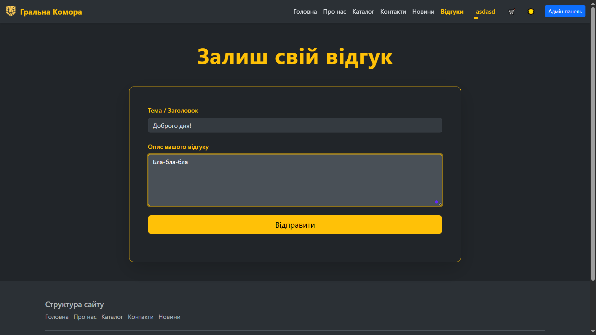
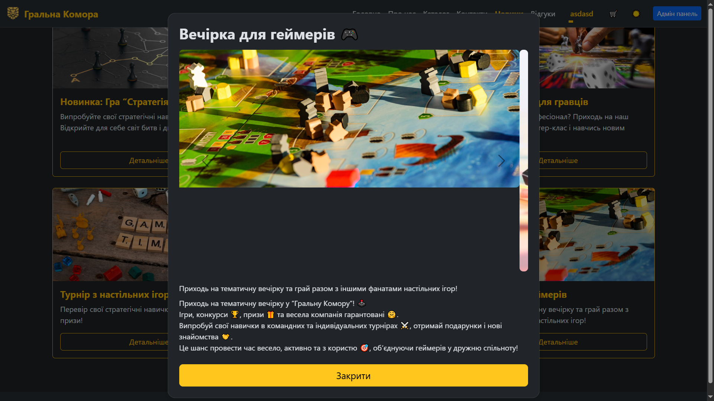
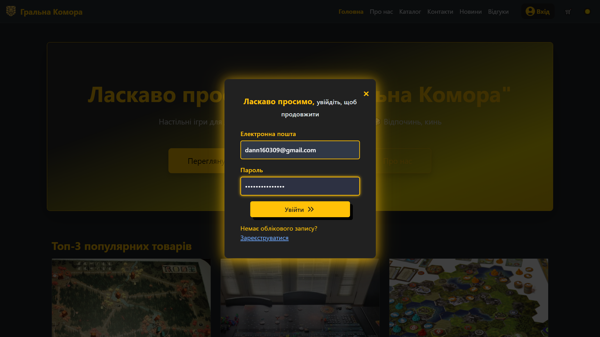
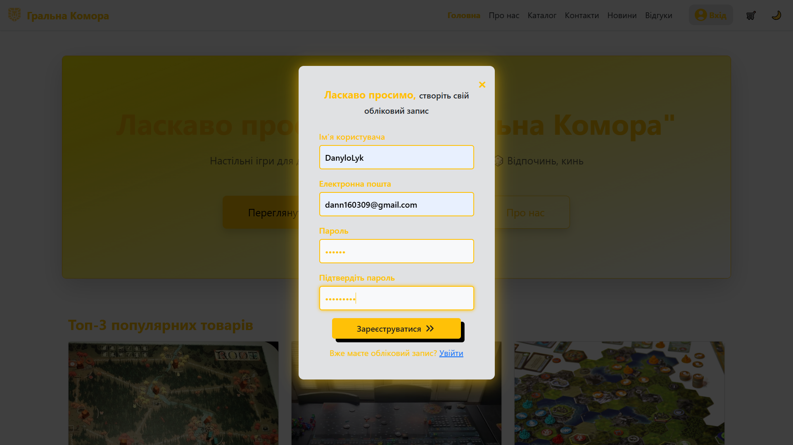
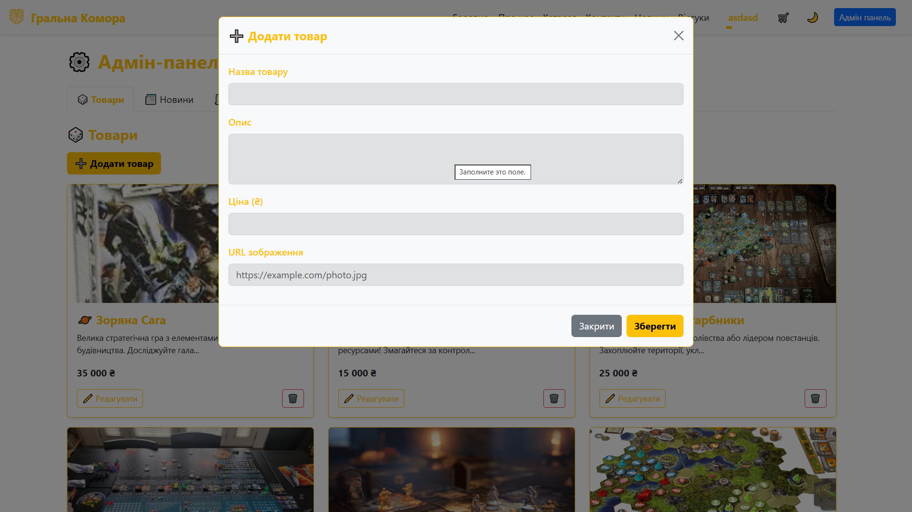
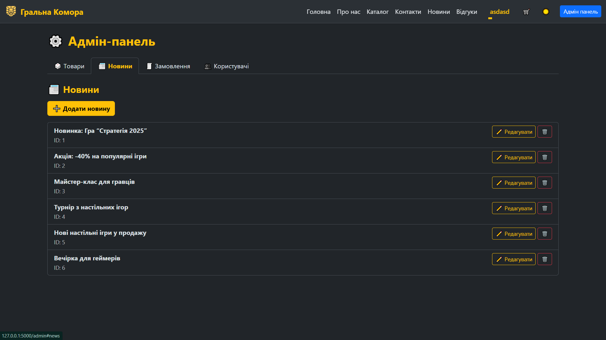
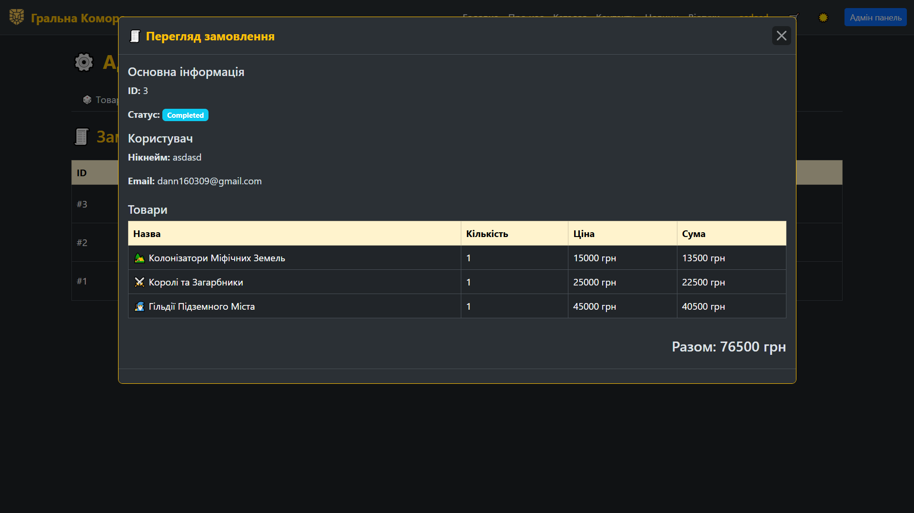
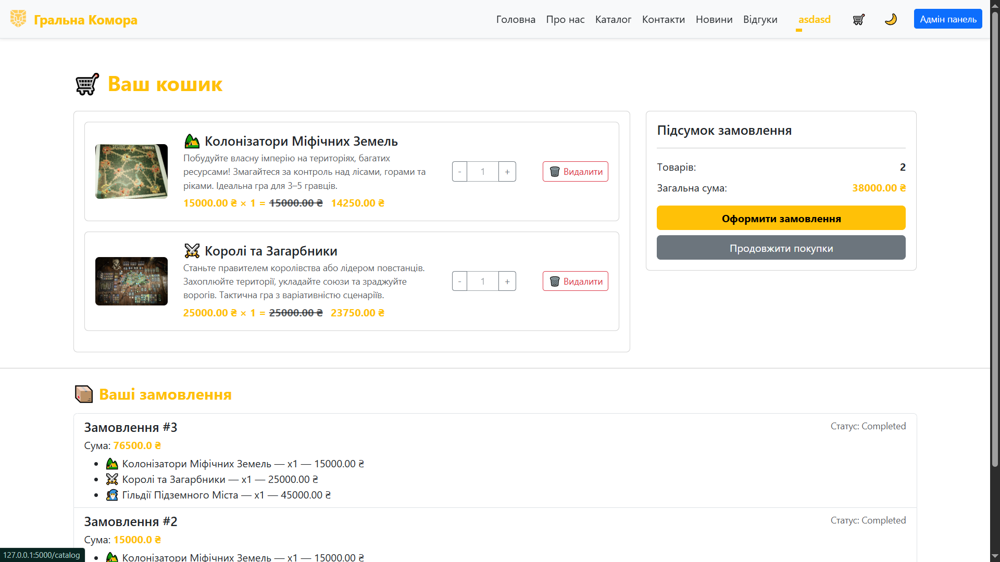
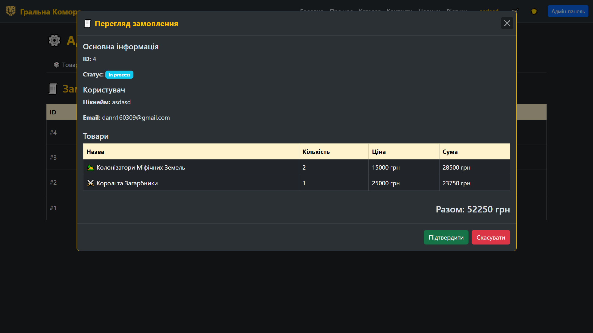
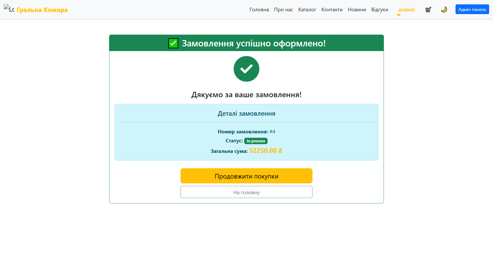

# Звіт з лабораторної роботи 4

## Реалізація бази даних для вебпроєкту

### Інформація про команду
- Назва команди:

- Учасники:
  - Лкащук Данило Миколайович - Team Lead / Fullstack Developer 

    (відповідальний за організацію роботи в Trello, GitHub, Discord та Telegram; створення репозиторію, requirements.txt, злиття гілок, перевірка PR; бекенд Flask, frontend, анімації, стилі, верстка, сторінки about, contacts, index, виправлення багів, документація, .gitignore, CHANGELOG.md)

  - Чорноус Сергій Павлович - Frontend Developer
    
    (відповідальний за інтерфейс проєкту, розробка інтерфейсу сайту, створення шаблонів HTML/CSS, структура base.html, catalog, footer, navbar, frontend-layout, верстка, логіка адаптивності, створення темного/світлого режимів)

  - Базюк Максим Володимирович - Backend Developer 
    
    (відповідальний за логіку проєкту, розробка логіки сайту на Flask, підключення бази даних, створення API для каталогу, з’єднання бекенду з фронтендом, створення маршрутів)

  - Кондратюк Дмитро Анатолійович - QA / Fullstack-Developer 
    
    (відповідальний за правильну роботу сайту, тестування, перевірення функціональності сайту на різних пристроях,  створення сторінок news, contacts, заповнення контенту, допомога з анімаціями, стилями та фронтендом)

## Завдання

### Обрана предметна область

Онлайн-магазин настільних ігор “Гральна Комора” — вебзастосунок-візитка магазину, який презентує асортимент настільних ігор, інформацію про компанію, контакти та новини.
Сайт створено з використанням Flask (Python) та системи шаблонів Bootstrap 5.

### Реалізовані вимоги

Вкажіть, які рівні завдань було виконано:

- [+] Рівень 1: Створено базу даних SQLite з таблицею для відгуків, реалізовано базові CRUD операції, створено адмін-панель для перегляду та видалення відгуків, додано функціональність магазину з таблицями для товарів та замовлень
- [+] Рівень 2: Створено додаткову таблицю, релевантну предметній області, реалізовано роботу з новою таблицею через адмін-панель, інтегровано функціональність у застосунок
- [+] Рівень 3: Розширено функціональність двома додатковими функціями, що суттєво покращують користувацький досвід

## Хід виконання роботи

### Підготовка середовища розробки

Опишіть процес налаштування:

- Версія Python: 3.13.5
- Встановлені бібліотеки (Flask, SQLite3 тощо): 

| Бібліотека | Версія |
|------------|--------|
| alembic | 1.17.0 |
| blinker | 1.9.0 |
| certifi | 2025.10.5 |
| charset-normalizer | 3.4.4 |
| click | 8.3.0 |
| colorama | 0.4.6 |
| Flask | 3.0.0 |
| Flask-Migrate | 4.1.0 |
| Flask-SQLAlchemy | 3.1.1 |
| greenlet | 3.2.4 |
| idna | 3.11 |
| itsdangerous | 2.2.0 |
| Jinja2 | 3.1.6 |
| Mako | 1.3.10 |
| MarkupSafe | 3.0.3 |
| requests | 2.32.5 |
| SQLAlchemy | 2.0.44 |
| typing_extensions | 4.15.0 |
| urllib3 | 2.5.0 |
| Werkzeug | 3.1.3 |

- Інші використані інструменти та розширення: GitHub, Trello, VS Code / PyCharm, Bootstrap 5, SQLite3, Flask-Migrate / Alembic.

### Структура проєкту

Наведіть структуру файлів та директорій вашого проєкту:

```
project/
│   .gitignore
│   app.py
│   CHANGELOG.md
│   README.md
│   requirements.txt
│
├───.idea
│   │   .gitignore
│   │   copilot.data.migration.agent.xml
│   │   copilot.data.migration.ask.xml
│   │   copilot.data.migration.ask2agent.xml
│   │   copilot.data.migration.edit.xml
│   │   misc.xml
│   │   modules.xml
│   │   Ne_Programisty.iml
│   │   PylintPlugin.xml
│   │   vcs.xml
│   │
│   └───inspectionProfiles
│           profiles_settings.xml
│
├───app
│   │   routes.py
│   │   utils.py
│   │   __init__.py
│   │
│   ├───models
│   │   │   cart.py
│   │   │   desktop.py
│   │   │   feedback.py
│   │   │   news.py
│   │   │   order.py
│   │   │   user.py
│   │   │
│   │   └───__pycache__
│   │           cart.cpython-313.pyc
│   │           desktop.cpython-313.pyc
│   │           feedback.cpython-313.pyc
│   │           news.cpython-313.pyc
│   │           order.cpython-313.pyc
│   │           user.cpython-313.pyc
│   │
│   ├───static
│   │   ├───css
│   │   │       feedback.css
│   │   │       loader.css
│   │   │       style.css
│   │   │
│   │   ├───images
│   │   │       0935ff4c0a7db15ea9cf644d8bd5ad58.jpg
│   │   │       1785
│   │   │       360_F_735447660_Mb1mTmfff8EhrRuornYjGkE9JlGUk4lP.jpg
│   │   │       5183bc21808b24662fd28c35ea0afd02.jpg
│   │   │       87a9ce69-716d-452e-acfe-d1b268e90a11.jpg
│   │   │       about1.jpg
│   │   │       about2.jpg
│   │   │       catalog2.jpg
│   │   │       catalog3.jpg
│   │   │       catalog4.jpg
│   │   │       catalog5.jpg
│   │   │       catalog9.jpg
│   │   │       ice-cubes-water-melt-cool-background-ice-blocks-cold-drinks-beverage-ice-cubes-water-melt-cool-background-153547983.jpg
│   │   │       logo.png
│   │   │       MTH-9055.jpg
│   │   │       nastolnye-strategii.jpg
│   │   │       news1-2.jpg
│   │   │       news1-3.jpg
│   │   │       news1.jpg
│   │   │       news2-2.jpg
│   │   │       news2-3.jpg
│   │   │       news2.jpg
│   │   │       news3-2.jpg
│   │   │       news3.jpg
│   │   │       news4-2.jpg
│   │   │       news4.jpg
│   │   │       news5-2.jpg
│   │   │       news5.jpg
│   │   │       news6-2.jpg
│   │   │       news6-3.jpg
│   │   │       news6.jpg
│   │   │       shahmati-magnitnie-3-v-1-mc%281%29-600x600.jpg
│   │   │       star_saga.jpg
│   │   │
│   │   └───js
│   │           admin.js
│   │           login.js
│   │           script.js
│   │
│   ├───templates
│   │   │   about.html
│   │   │   admin.html
│   │   │   base.html
│   │   │   cart.html
│   │   │   catalog.html
│   │   │   checkout.html
│   │   │   contacts.html
│   │   │   feedback.html
│   │   │   index.html
│   │   │   news.html
│   │   │   order_success.html
│   │   │
│   │   └───components
│   │       │   catalog-card-mb.html
│   │       │   catalog-card-pc.html
│   │       │   footer.html
│   │       │   header.html
│   │       │   loader.html
│   │       │   login-panel.html
│   │       │
│   │       └───admin
│   │               add_item.html
│   │               add_news.html
│   │               edit_item.html
│   │               edit_news.html
│   │               edit_user.html
│   │               order_info.html
│   │
│   └───__pycache__
│           routes.cpython-313.pyc
│           utils.cpython-313.pyc
│           __init__.cpython-313.pyc
│
├───instance
│       mydatabase.db
│
├───lab-reports
│   │   lab02-report.md
│   │
│   ├───lab3
│   │   │   lab03-report-Danylo.md
│   │   │   lab03-report-Serhii.md
│   │   │
│   │   └───screenshots
│   │           about.png
│   │           catalog.png
│   │           contacts.png
│   │           index.png
│   │           news1.png
│   │           news2.png
│   │
│   └───lab4
│           lab04-report.md
│
└───migrations
    │   alembic.ini
    │   env.py
    │   README
    │   script.py.mako
    │
    └───versions
            2af27a861054_create_news_table.py
```

### Проектування бази даних

#### Схема бази даних

Опишіть структуру вашої бази даних:

```
Таблиця "desktop":
- id (INTEGER, PRIMARY KEY)
- name (VARCHAR(100), NOT NULL)
- description (VARCHAR(100), NOT NULL)
- price (FLOAT, NOT NULL)
- image (VARCHAR(255), NOT NULL)

Таблиця "feedback":
- id (INTEGER, PRIMARY KEY)
- title (VARCHAR(100), NOT NULL)
- description (VARCHAR(300), NOT NULL)

Таблиця "news":
- id (INTEGER, PRIMARY KEY)
- name (VARCHAR(100), NOT NULL)
- description (VARCHAR(300), NOT NULL)
- descriptionSecond (VARCHAR(300), NOT NULL)

Таблиця "news_image":
- id (INTEGER, PRIMARY KEY)
- img_url (VARCHAR(255), NOT NULL)
- news_id (INTEGER, FOREIGN KEY -> news.id, NOT NULL)

Таблиця "cart_items":
- id (INTEGER, PRIMARY KEY)
- user_id (INTEGER)
- item_id (INTEGER, FOREIGN KEY -> desktop.id, NOT NULL)
- quantity (INTEGER, NOT NULL)

Таблиця "orders":
- id (INTEGER, PRIMARY KEY)
- user_id (INTEGER, NOT NULL)
- total_amount (FLOAT, NOT NULL)
- status (VARCHAR(50), NOT NULL)
- items (JSON, NOT NULL)

Таблиця "users":
- id (INTEGER, PRIMARY KEY)
- nickname (VARCHAR(80), UNIQUE, NOT NULL)
- email (VARCHAR(120), UNIQUE, NOT NULL)
- password (VARCHAR(200), NOT NULL)
- status (VARCHAR(20))
- privilege (VARCHAR(20))
```


### Опис реалізованої функціональності

#### Система відгуків
- Користувачі можуть залишати відгуки через форму зворотного зв'язку.
- Для відправки відгуку користувач має бути зареєстрованим та авторизованим.
- Всі відгуки зберігаються в таблиці `feedback`.
- Адміністративна панель дозволяє переглядати та видаляти відгуки.

#### Магазин
- Каталог товарів (`desktop`) відображається для користувачів з можливістю додавання товарів у кошик.
- Кошик (`cart_items`) зберігає додані товари та їх кількість.
- Можливість видаляти товари з кошика або змінювати кількість кожного товару.
- Історія замовлень зберігається в таблиці `orders`.
- Оформлення замовлення з автоматичним обчисленням суми разом зі знижками та збереженням списку товарів у форматі JSON.

#### Адміністративна панель
- Управління товарами: додавання, редагування, видалення.
- Управління новинами: додавання, редагування, видалення.
- Управління користувачами: редагування статусу (адмін/модер/користувач) та привілеїв.
- Перегляд та підтвердження/відмова замовлень.
- Перегляд усіх відгуків користувачів.

#### Додаткова функціональність (рівні 2 та 3)
- Реалізована система користувачів з різними ролями (адміністратор, користувач).
- Реалізована система користувачів з різними привілеями (Default, Gold, Diamond, VIP).
- Історія замовлень для кожного користувача.
- Можливість авторизованим користувачам залишати відгуки та додавати товари до кошика.
- Привілеї користувачів впливають на застосування знижок.
- Каталог та новини інтегровані у веб-застосунок для зручного перегляду користувачами.

## Ключові фрагменти коду

### Ініціалізація бази даних

Для веб-застосунку використовується SQLAlchemy ORM для взаємодії з базою даних SQLite.  
Нижче наведено основні моделі та структуру таблиць.

#### Таблиця "users"
```python
class User(db.Model):
    __tablename__ = 'users'

    id = db.Column(db.Integer, primary_key=True, autoincrement=True)
    nickname = db.Column(db.String(80), unique=True, nullable=False)
    email = db.Column(db.String(120), unique=True, nullable=False)
    password = db.Column(db.String(200), nullable=False)
    status = db.Column(db.String(20), default='User')
    privilege = db.Column(db.String(20), default='Default')
```

#### Таблиця "desktop" (каталог товарів)

```python
class Desktop(db.Model):
    id = db.Column(db.Integer, primary_key=True)
    name = db.Column(db.String(100), nullable=False)
    description = db.Column(db.String(100), nullable=False)
    price = db.Column(db.Float, nullable=False)
    image = db.Column(db.String(255), nullable=False)
```

#### Таблиця "cart_items" (товари в кошику)

```python
class CartItem(db.Model):
    __tablename__ = 'cart_items'

    id = db.Column(db.Integer, primary_key=True)
    user_id = db.Column(db.Integer, db.ForeignKey('users.id'), nullable=False)
    item_id = db.Column(db.Integer, db.ForeignKey('desktop.id'), nullable=False)
    quantity = db.Column(db.Integer, default=1, nullable=False)
```

#### Таблиця "feedback" (система відгуків)

```python
class Feedback(db.Model):
    id = db.Column(db.Integer, primary_key=True)
    title = db.Column(db.String(100), nullable=False)
    description = db.Column(db.String(300), nullable=False)
    user_id = db.Column(db.Integer, db.ForeignKey('users.id'), nullable=False)
```

#### Таблиця "news" та "news_image" (новини)

```python
class News(db.Model):
    id = db.Column(db.Integer, primary_key=True)
    name = db.Column(db.String(100), nullable=False)
    description = db.Column(db.String(300), nullable=False)
    descriptionSecond = db.Column(db.String(300), nullable=False)
    images = db.relationship('NewsImage', back_populates='news', lazy=True, cascade="all, delete-orphan")

class NewsImage(db.Model):
    __tablename__ = 'news_image'
    id = db.Column(db.Integer, primary_key=True)
    img_url = db.Column(db.String(255), nullable=False)
    news_id = db.Column(db.Integer, db.ForeignKey('news.id'), nullable=False)
```

#### Таблиця "orders" (замовлення)

```python
class Order(db.Model):
    __tablename__ = 'orders'

    id = db.Column(db.Integer, primary_key=True)
    user_id = db.Column(db.Integer, db.ForeignKey('users.id'), nullable=False)
    total_amount = db.Column(db.Float, nullable=False)
    status = db.Column(db.String(50), default='completed', nullable=False)
    items = db.Column(db.JSON, nullable=False, default=list)
```
Для ініціалізації бази даних у Flask використовується метод db.create_all(), який створює всі таблиці, якщо вони ще не існують:

```python
from app import db

def init_db():
    db.create_all()
```

### CRUD операції з використанням SQLAlchemy

#### Створення (Create)
```python
def add_feedback(title, description, user_id):
    feedback = Feedback(title=title, description=description, user_id=user_id)
    db.session.add(feedback)
    db.session.commit()
    return feedback
```

#### Читання (Read)

```python
def get_all_feedback():
    return Feedback.query.order_by(Feedback.id.desc()).all()

def get_feedback_by_id(feedback_id):
    return Feedback.query.get(feedback_id)
```

#### Оновлення (Update)

```python
def update_order_status(order_id, status):
    order = Order.query.get(order_id)
    if order:
        order.status = status
        db.session.commit()
    return order
```

#### Видалення (Delete)

```python
def delete_feedback(feedback_id):
    feedback = Feedback.query.get(feedback_id)
    if feedback:
        db.session.delete(feedback)
        db.session.commit()
```

#### Додаткові приклади для кошика та користувачів

#### Додавання товару в кошик

```python
def add_to_cart(user_id, item_id, quantity=1):
    cart_item = CartItem.query.filter_by(user_id=user_id, item_id=item_id).first()
    if cart_item:
        cart_item.quantity += quantity
    else:
        cart_item = CartItem(user_id=user_id, item_id=item_id, quantity=quantity)
        db.session.add(cart_item)
    db.session.commit()
    return cart_item
```

#### Видалення товару з кошика

```python
def remove_from_cart(user_id, item_id):
    cart_item = CartItem.query.filter_by(user_id=user_id, item_id=item_id).first()
    if cart_item:
        db.session.delete(cart_item)
        db.session.commit()
```

#### Оновлення кількості товару в кошику

```python
def update_cart_item(user_id, item_id, new_quantity):
    cart_item = CartItem.query.filter_by(user_id=user_id, item_id=item_id).first()
    if cart_item:
        if new_quantity <= 0:
            db.session.delete(cart_item)
        else:
            cart_item.quantity = new_quantity
        db.session.commit()
```

#### Створення нового користувача

```python
def register_user(nickname, email, password):
    user = User(nickname=nickname, email=email)
    user.set_password(password)
    db.session.add(user)
    db.session.commit()
    return user
```

Чудово! Тепер я можу переписати **маршрутизацію** та **роботу зі зв’язками між таблицями** у вигляді готового прикладу, використовуючи ваш **реальний код**. Ось як це виглядає:

---

## Маршрутизація 

### Відгуки користувачів

```python
@main.route('/feedback')
def feedback():
    # Повертаємо сторінку з усіма відгуками
    all_feedback = Feedback.query.order_by(Feedback.id.desc()).all()
    return render_template('feedback.html', feedbacks=all_feedback)

@main.route('/submit_feedback', methods=['POST'])
def submit_feedback():
    data = request.get_json()
    title = data.get('title')
    description = data.get('description')

    if not title or not description:
        return jsonify({'success': False, 'error': 'Заголовок та опис є обов\'язковими.'}), 400

    if len(title) > 100 or len(description) > 300:
        return jsonify({'success': False, 'error': 'Перевищено ліміт символів.'}), 400

    new_feedback = Feedback(title=title, description=description)
    db.session.add(new_feedback)
    db.session.commit()

    return jsonify({'success': True, 'message': 'Відгук додано!'}), 201
```

### Кошик та замовлення

```python
@main.route('/add_to_cart/<int:item_id>')
@login_required
def add_to_cart(item_id):
    user_id = g.current_user.id
    quantity = int(request.args.get('quantity', 1))
    desktop = Desktop.query.get_or_404(item_id)

    existing_item = CartItem.query.filter_by(user_id=user_id, item_id=item_id).first()
    if existing_item:
        existing_item.quantity += quantity
    else:
        db.session.add(CartItem(user_id=user_id, item_id=item_id, quantity=quantity))
    db.session.commit()
    return redirect(url_for('main.catalog'))

@main.route('/checkout')
@login_required
def checkout():
    user_id = g.current_user.id
    cart_items = CartItem.query.filter_by(user_id=user_id).all()

    carts = []
    total_amount = 0.0
    discount_multiplier = getattr(g.current_user, 'discount_multiplier', 1.0)

    for item in cart_items:
        price = float(str(item.item.price).replace(' ', '').replace(',', '.'))
        item_total = price * item.quantity * discount_multiplier
        total_amount += item_total
        carts.append({
            'id': item.id,
            'name': item.item.name,
            'quantity': item.quantity,
            'price': price,
            'total': round(item_total, 2)
        })

    return render_template('checkout.html', carts=carts, total_amount=round(total_amount,2))
```

## Робота зі зв’язками між таблицями 

### Приклад: отримати деталі замовлення разом із товарами та користувачем

```python
def get_order_details(order_id):
    order = Order.query.get(order_id)
    if not order:
        return None

    details = []
    for item in order.items:  # items - це список словників з item_id, quantity, discount
        desktop = Desktop.query.get(item['item_id'])
        if desktop:
            details.append({
                'product_name': desktop.name,
                'product_price': desktop.price,
                'quantity': item['quantity'],
                'discount': item.get('discount', 1.0),
                'total': round(desktop.price * item['quantity'] * item.get('discount', 1.0), 2)
            })

    order_info = {
        'order_id': order.id,
        'status': order.status,
        'user_nickname': order.user.nickname,
        'user_email': order.user.email,
        'items': details,
        'total_amount': round(order.total_amount, 2)
    }
    return order_info
```

### JSON-відповідь для фронтенду

```python
@main.route('/get_order/<int:order_id>')
def get_order(order_id):
    order_info = get_order_details(order_id)
    if not order_info:
        return jsonify({'success': False, 'error': 'Замовлення не знайдено'}), 404
    return jsonify({'success': True, 'order': order_info})
```


Окей, давай складемо **розподіл обов’язків** по вашій команді на основі твоїх описів та комітів. Я зроблю це структуровано та зрозуміло для документації чи звіту.

---

## **Розподіл обов'язків у команді**

- **Данило Лукащук (DanyloLyk)**

  * Розробка **адмін-панелі** для керування товарами, новинами, користувачами та замовленнями.
  * Організація роботи команди на GitHub та контроль версій.
  * Дебаг фронтенду: кнопка «Вхід», модальне вікно авторизації, загальний стиль та дизайн сайту.
  * Усунення багів та конфліктів при злитті гілок.
  * Загальна координація проєкту, допомога з оформленням та фронтенд-логікою.

- **Максим Базюк (WarpDraper)**

  * Створення моделі Feedback для збереження відгуків користувачів.
  * Міграція новин з статичних даних у базу даних.
  * Усунення багів у відображенні каталогу товарів.
  * Розробка сторінки Feedback з перевіркою даних та логуванням.
  * Додавання анімованого лоадера з 3D-елементами.

- **Сергій Чорноус (PearLand-1)**

  * Реєстрація та авторизація користувачів: перевірка пароля та підтвердження, шифрування пароля, збереження користувача в базі та підтримка сесій.
  * Реалізація функції вихід користувача.
  * Створення таблиць Cart та Order у базі даних.
  * Роутери для роботи з кошиком та замовленнями: додавання товарів у кошик, видалення, отримання даних по `user_id`.
  * Розробка логіки знижок та привілеїв користувачів.

- Дмитро Кондратюк (dmutrokondratyk2008)

  * Створення таблиці Users у базі даних.
  * Розробка кнопки «Вхід» та форми реєстрації з анімаціями на фронтенді.
  * Реалізація виходу з сесії та логіки роботи зі статусами користувачів.
  * Впровадження системи привілеїв користувачів (наприклад, адмінські права та знижки).


## Скріншоти

Додайте скріншоти основних функцій вашого вебзастосунку:

### Форма зворотного зв'язку



### Каталог товарів


### Список новин



### Вхід



### Реєстрація



### Адміністративна панель/Додавання товару



### Адміністративна панель/Новини



### Адміністративна панель/Перегляд замовлень



### Управління замовленнями



### Оформлення замовлення



### Підтвердження замовлення




## Тестування

### Сценарії тестування

Опишіть, які сценарії ви тестували:

Під час розробки застосунку було проведено комплексне тестування функціональності, взаємодії з базою даних, інтерфейсу та ролей користувачів. Тестування охоплювало як позитивні сценарії, так і ситуації з помилками.

1. Додавання нового відгуку та перевірка його відображення в адмін-панелі
2. Створення товару, додавання його до кошика та оформлення замовлення
3. Зміна статусу замовлення через адмін-панель
4. Видалення записів з бази даних
5. Тестування ролей користувачів та привілеїв
6. Тестування інтерфейсу та анімацій
7. Тестування на стійкість і помилки

## Висновки

У ході виконання лабораторної роботи команді вдалося реалізувати повноцінний веб-застосунок із використанням Flask та реляційної бази даних SQLite. Успішно були впроваджені всі основні модулі: система авторизації та реєстрації, адмін-панель, робота з товарами, кошиком, замовленнями, новинами, відгуками та статусами користувачів. Проєкт вийшов комплексним та максимально наближеним до реальних сценаріїв розробки.

- Що вдалося реалізувати успішно

    * Створено продуману структуру бази даних із кількома взаємопов’язаними таблицями (users, orders, cart_items, news, feedback тощо).
    * Реалізовано повний цикл роботи з даними: створення, читання, оновлення та видалення (CRUD).
    * Розроблено потужну адмін-панель для управління товарами, користувачами, новинами, замовленнями та відгуками.
    * Налаштовано систему аутентифікації, авторизації та привілегій користувачів.
    * Забезпечено коректну роботу кошика та механізму оформлення замовлень, включно з урахуванням знижок.
    * Додано інтерфейс для роботи з відгуками та новинами, включно з можливістю додавати зображення.
    * Опрацьовано десятки сценаріїв тестування і усунуто значну кількість помилок під час інтеграції.

- Отримані навички роботи з базами даних

    * Проєктування реляційних схем та визначення зв’язків між таблицями.
    * Робота зі складними SELECT-запитами, JOIN-ами, фільтрацією та агрегацією.
    * Створення моделей ORM та логічного шарового поділу між кодом та БД.
    * Обробка транзакцій, захист даних, валідація введення.
    * Вміння оптимізувати структуру зберігання, нормалізувати таблиці та підтримувати узгодженість даних.

- Основні труднощі під час проєктування БД

    * Потрібно було визначити оптимальний спосіб зберігання замовлень та їхніх позицій.
    * Виникали конфлікти при об’єднанні гілок Git через несинхронні зміни в БД.
    * Складність побудови зв’язків між користувачами, привілеями, замовленнями та товарами.
    * Необхідність забезпечити валідність введення даних і уникнення дублювання.
    * Узгодження структури моделі з потребами фронтенду та адмін-панелі.

- Командна робота

    * Була організована чітка структуризація завдань через гілки Git та регулярні злиття.
    * Кожен учасник відповідав за свій модуль, але всі взаємодіяли для інтеграції.
    * При виникненні конфліктів коду проводили спільний дебаг, тестування та виправлення.
    * Було налагоджено ефективну комунікацію: обговорення структури БД, узгодження API, рев’ю коду.
    * Кожний учасник значно доповнив загальний функціонал, і команда працювала як єдиний механізм.

- Можливі покращення в майбутньому

    * Перехід із SQLite на PostgreSQL або MySQL для більшої продуктивності.
    * Додавання токен-авторизації та JWT для інтеграції мобільного застосунку.
    * Розширення адмін-панелі: графіки, аналітика продажів, статистика користувачів.
    * Впровадження мікросервісної архітектури або окремого API-шару.
    * Оптимізація фронтенду та впровадження SPA-рішень на React або Vue.
    * Покращення системи ролей та прав користувачів.
    * Інтеграція платіжних систем і push-сповіщень.

Очікувана оцінка: 12 балів

Обґрунтування: 

* Проєкт реалізовано **повністю**, з надлишком рекомендованого функціоналу.
* Команда створила **реальний робочий сайт** із кошиком, оплатою, привілеями, новинами, адмін-панеллю та збереженням даних у БД.
* Продемонстровано **глибоке розуміння** роботи з реляційними БД, ORM, Flask та веб-розробкою загалом.
* Виконано **командну розробку** з використанням Git, що значно ускладнює і підвищує рівень роботи.
* Виконано тестування, усунено десятки багів, забезпечено стабільність системи.
* Структура БД, маршрути, моделі та функціонал гарно оформленні.
